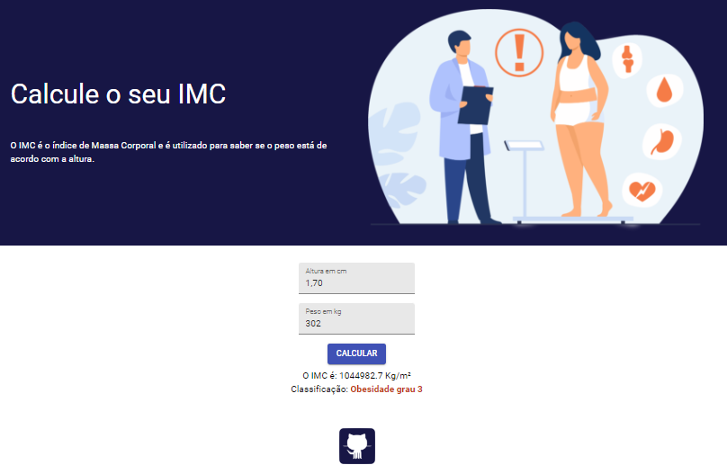

# IMC COM NEXTJS
👨‍🏫CALCULADORA DE IMC CRIADA COM NEXT.JS, TYPESCRIPT, SASS E MATERIAL UI.

 <br>  

## DESCRIÇÃO:
Este aplicativo de "Calculadora de IMC" foi desenvolvido com Next.js e usa Material-UI para a interface do usuário. Ele permite que os usuários calculem seu Índice de Massa Corporal (IMC) com base em sua altura e peso. O aplicativo fornece uma classificação do IMC que indica se o usuário está abaixo do peso, com peso normal, com sobrepeso ou com diferentes graus de obesidade.

## FUNCIONALIDADES:
1. **Entrada de Dados:**
   - O usuário insere sua altura em centímetros e seu peso em quilogramas em campos de texto.
   
2. **Cálculo do IMC:**
   - Ao clicar no botão "Calcular", o aplicativo calcula o IMC usando a fórmula: `IMC = peso / (altura em metros ^ 2)`.
   
3. **Classificação do IMC:**
   - O resultado do IMC é exibido junto com uma classificação que indica se o usuário está:
     - Abaixo do peso
     - Com peso normal
     - Com sobrepeso
     - Com obesidade grau 1
     - Com obesidade grau 2
     - Com obesidade grau 3

4. **Link para GitHub:**
   - Há um link para o perfil do GitHub do desenvolvedor.

## EXECUTANDO O PROJETO:
1. **Instalar as dependências do projeto**:
   - Execute o comando no diretório `CODIGO/`:
     ```cmd
     npm install
     ```
   Este comando instala todas as dependências listadas no arquivo `package.json` do seu projeto. Certifique-se de estar no diretório do seu projeto ao executar este comando.

2. **Subindo o Servidor:**
   - Para subir o servidor abra Terminal/CMD e digite o seguinte comando:
   ```bash
   npm run dev
   ```
   - Acesse o APP no navegador visitando [`http://localhost:3000/`](http://localhost:3000/).

3. **Usando o APP:**
   1. **Inserir Altura e Peso:**
      - Digite sua altura em centímetros no campo "Altura em cm".
      - Digite seu peso em quilogramas no campo "Peso em kg".

   2. **Calcular IMC:**
      - Clique no botão "Calcular".
      - O IMC será calculado e exibido na tela junto com a classificação correspondente.

   3. **Verificar Classificação:**
      - Abaixo do resultado do IMC, a classificação será exibida indicando se você está abaixo do peso, com peso normal, sobrepeso ou obeso.

   4. **Acessar GitHub:**
      - Clique no ícone do GitHub para visitar o perfil do desenvolvedor.

## EXEMPLO DE USO:
- Se você inserir "170" no campo de altura e "70" no campo de peso, e clicar em "Calcular", o aplicativo calculará seu IMC como 24.22 e exibirá a classificação "Peso Normal".

## NÃO SABE?
- Entendemos que para manipular arquivos em `HTML`, `CSS` e outras linguagens relacionadas, é necessário possuir conhecimento nessas áreas. Para auxiliar nesse aprendizado, oferecemos cursos gratuitos disponíveis:
* [CURSO DE NEXTJS](https://github.com/VILHALVA/CURSO-DE-NEXTJS)
* [CURSO DE HTML E CSS](https://github.com/VILHALVA/CURSO-DE-HTML-E-CSS)
* [CURSO DE SCSS](https://github.com/VILHALVA/CURSO-DE-SCSS)
* [CURSO DE TYPESCRIPT](https://github.com/VILHALVA/CURSO-DE-TYPESCRIPT)
* [CURSO DE NODEJS](https://github.com/VILHALVA/CURSO-DE-NODEJS)
* [CONFIRA MAIS CURSOS](https://github.com/VILHALVA?tab=repositories&q=+topic:CURSO)

## CREDITOS:
- [PROJETO CRIADO PELO "danielafarias"](https://github.com/danielafarias/calculadora-imc)
- [PROJETO FEITO E EDITADO PELO VILHALVA](https://github.com/VILHALVA)


